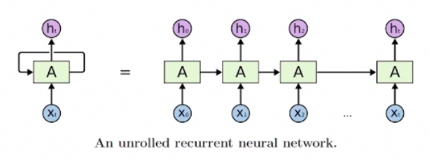

# 강의 요약

## 신경망 네트워크의 정규화

### 1. 정규화

- 높은 분산으로 데이터에 대한 overfitting이 의심될 때 가장 먼저 시도, 높은 분산을 해결하기 위해 더 많은 훈련데이터 or 정규화를 추가(신경망의 분산을 줄인다)
- 로지스틱 회귀 : cost function의 최소화
- L2 regularization(=weight decay(가중치 감쇠)) : 매개변수 벡터 w의 L2 norm을 사용
    
    → w는 높은 차원의 매개변수이기 때문에 높은 분산일 때 다양한 매개 변수를 갖고, b는 실수이기 때문에 그 매개변수의 차이가 많이 나므로 굳이 b를 고려하지 않아도 된다.
    
    → weight decay라고 불리는 이유는 weight에 1보다 작은 값이 곱해지기 때문에
    
    
    
    L1 regularization : 모델 희소를 위해 자주 사용, 모델 축소가 아닌 이상 잘 사용하지 않는다.
    
    람다 (regularization parameter)를 사용 → 이것 역시 hyper parameter에 속함
    
    
    

Neural network에서의 정규화 : l개의 layer에 있어서의 regularization항을 모두 더한 값을 이용해서 부른다.

---

### 2. 왜 정규화는 과대적합을 줄일 수 있을까요?

- 과대적합의 문제가 있는 신경망의 경우에 w,b에 대한 비용함수 J에 대한 정의 중 정규화 관련된 항을 줄이는 것이 왜 도움이 되는것인가?
→ 정규화에서의 parameter를 키울수록 가중치 행렬 w를 0에 가깝게 설정하여 은닉층에 대한 영향력을 줄인다. → 단순화된 신경망으로 만드는 것임(분산의 감소)


- overfitting에 대한 regularization에 대한 또다른 직관적 견해
    
    g(z):tanh(z)일 때 람다(regularization parameter)가 커질 때 cost function을 줄이려면 상대적으로 w가 작아져야한다. w(가중치)가 작으면 z도 상대적으로 작은 값을 가지게 된다. z가 상대적으로 작은 값을 갖게 되면 (-1~1사이의 값) → 선형회귀에 가까운 함수를 가지기때문에 비선형 결정의 경계에 맞추기 어려워진다.
    
- 구현에 대한 팁!
    
    정규화 구현 시 J에 대해 가중치(w)가 너무 커지는 것을 막기위한 추가적인 항을 구성, 경사 하강법을 정의하기 위해 반복의 수에 대한 함수로 비용함수를 설정 → 정규화를 구현할 때 비용함수 J의 첫 항만 사용하면 단조 감소를 관찰하기 어렵다.
    

---

### 3. 드롭아웃 정규화

- L2 정규화 외에 자주 사용하는 방법
- 각각의 신경망 층에 대해 일부 노드를 삭제하는 확률을 설정하는 것이다.
    
    
    
- dropout 구현방법
    - inverted dropout : 노드를 삭제한 후의 얻은 활성화 값에 keep_prop으로 다시 나눠주는 기법(d3는 0.8의 확률로 1(True), 0.2의 확률로 0(False)을 갖게 될 것임)
        
        ```python
        # keep_prop = 0.8
        d3=np.random.rand(a3.shape[0],a3.shape[1]) < keep_prop
        
        # d3에 대응되는 a3의 값 중 일부를 0으로 만들기 위해 곱한다.
        a3=np.multiple(a3,d3)
        
        # a^[3]의 원소 수가 0.2만큼 제거되므로 기댓값을 유지하기 위해 keep_prop으로 나눠줘야한다
        a3 /= keep_prop 
        ```
        

- Making predictions at test time : test 때는 dropout을 사용하지 않는다 → 무작위의 결과가 나올 수 있는데 이를 원하진 않음(노이즈만 증가시킬뿐)

---

### 4. 드롭아웃의 이해

- 일부 노드를 삭제하는 것이 왜 정규화로서 쓰이는가?
    - 입력값이 랜덤하게 결정되면서 특정 입력에 기댈 수 없음 (큰 가중치를 부여하기 어려움) 따라서 각 경우에 동일한 가중치를 부여함으로서 가중치 값을 줄일 수 있다.
    - keep_prop은 층마다 다르게 설정할 수 있는데,입력층에 대해서는 1에 가까운 값을 사용하는데 정보로 사용되는 입력층을 최대한 손상시키지 않기위해

---

### 5. 다른 정규화 방법들

- Data augmentation : 기존의 이미지에서의 약간의 변화를 통해 더 다양한 데이터를 학습에 이용
    
    → 납득 가능한 선에서 변환시킬 것 (고양이가 뒤집어져있는 경우는 많지 않다)
    
    데이터 수집 자체가 도움이 되지만 추가적인 비용이 요구된다
    
- Early stopping
    
    dev set error가 training error와 가장 유사할 때 훈련을 멈추는 것 
    
    training error가 감소하면서 dev set error가 증가하는 시점이 overfitting이 시작되는 시점이므로 이 부분에서 학습을 정지시킨다. 
    
    단점 : J에 대한 최적화 시 w,b값을 정확히 찾는 것이 중요, 그러나 overfitting을 막는 것 (분산을 줄이는 것)은 이와는 다른 문제 (직교화)
    
    → w,b의 최적화와 overfitting의 방지는 같은 관점에서의 문제가 아님에도 불구하고 early stopping을 선택한다면 w,b의 최적화에 방해될 수도 있음, 이에 대한 대안으로 L2 regularization을 주로 사용한다.
    
    → l2의 단점은 추가적인 hyper parameter에 대한 고려가 필요해진다는 것